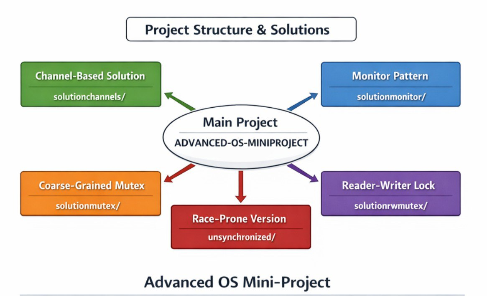

# Advanced OS Mini-Project

## Table of Contents
- [Project Structure](#project-structure)
- [Team Contribution](#team-contribution)
- [Build & Test Instructions](#build--test-instructions)
- [Performance Summary](#performance-summary)
- [Expected Test Scenarios](#expected-test-scenarios)
- [Race Detection](#race-detection)

---

## Project Structure
'''
ADVANCED-OS-MINIPROJECT/
├── solutionchannels/     # Channel-based implementation
├── solutionmonitor/      # Monitor pattern implementation  
├── solutionmutex/        # Coarse-grained mutex implementation
├── solutionrwmutex/      # Reader-writer lock implementation
├── unsynchronized/       # Original race-prone implementation
├── README.md             # This file
├── image.png             # Project Structure Overview (Visual Description)
└── go.mod                # Root Go module
'''



## Team Contribution
This project was completed by **LAKEHAL AMANI ALA** and **YALAOUI DJAMILA** through daily collaborative sessions.

### Collaboration Approach
We worked together on all four solutions using pair programming via Google Meet (3 hours daily from project assignment). Both members actively coded, debugged, and tested each approach simultaneously—one driving implementation while the other reviewed logic, then switching roles.

### Roles and Focus Areas
- **YALAOUI DJAMILA**: Led race condition analysis and benchmarking.
- **LAKEHAL AMANI ALA**: Focused on test design and documentation clarity.

### Collaboration Practices
- Real-time code reviews
- Debugging sessions using Go’s race detector
- Collaborative report writing

This approach ensured both members developed a deep understanding of each synchronization technique.

## Build & Test Instructions

### Prerequisites
- Go 1.20+ (required for race detector)
- Terminal or command prompt access

### Step 1: Setup
1. Unzip the file `advanced-os-miniproject.rar`
2. Open the extracted folder in VS Code
3. Navigate to the project directory:
```bash
cd ADVANCED-OS-MINIPROJECT
```
### Step 2: Observe Race Conditions
Run the unsynchronized version to witness race conditions:
```
cd unsynchronized
go run -race .
```
Expected Output:
Race detector warnings and incorrect results in all three scenarios.


### Step 3: Test All Solutions
Each solution directory contains a complete implementation. Test them individually as follows:

**1. Coarse-Grained Mutex**
```
cd solutionmutex
go test -v                # Run all tests
go test -race -v          # Check for race conditions (should pass)
go test -bench=. -benchmem  # Run benchmarks
```
**2. Monitor Pattern**
```
cd solutionmonitor
go test -v                
go test -race -v          
go test -bench=. -benchmem
```
**3. Reader-Writer Lock**
```
cd solutionrwmutex
go test -v                
go test -race -v          
go test -bench=. -benchmem
```
**4. Channel-Based Solution**
```
cd solutionchannels
go test -v                
go test -race -v          
go test -bench=. -benchmem
```

## Performance Summary
**Based on our benchmarks:**

In our performance analysis, the channel-based approach demonstrated the fastest execution and best overall throughput, excelling particularly in concurrency scenarios. The reader-writer mutex (RWMutex) proved ideal for read-heavy workloads by allowing multiple concurrent read operations while maintaining data consistency. The standard mutex implementation, while straightforward and correct in all scenarios, showed slower performance compared to both channels and RWMutex. Finally, the monitor pattern implementation, though guaranteed safe under all tested conditions, incurred the highest overhead and was the slowest among all approaches, making it less suitable for performance-critical applications despite its robustness.

## Expected Test Scenarios
All solutions handle the following scenarios correctly:


Lost Update Problem – Counter increments preserved


Bank Transfer Anomaly – Total balance preserved


Inconsistent Reads – Readers see a consistent state


High Concurrency – 20+ goroutines work correctly
## All Approaches Passed Race Detection

All four synchronization approaches—Coarse-Grained Mutex, Monitor Pattern, Reader-Writer Lock, and Channel-Based implementation—were tested across all three critical scenarios: Lost Update Problem, Bank Transfer Anomaly, and Inconsistent Reads. For each approach, we ran the program using Go’s race detector (go run -race .) to ensure that no race conditions occurred during execution. In every case, all approaches passed successfully: counters were incremented correctly, total balances in the bank transfer scenario were preserved, and readers observed consistent state without seeing partial updates. This confirms that each implementation is robust, correct, and safe under high concurrency.
